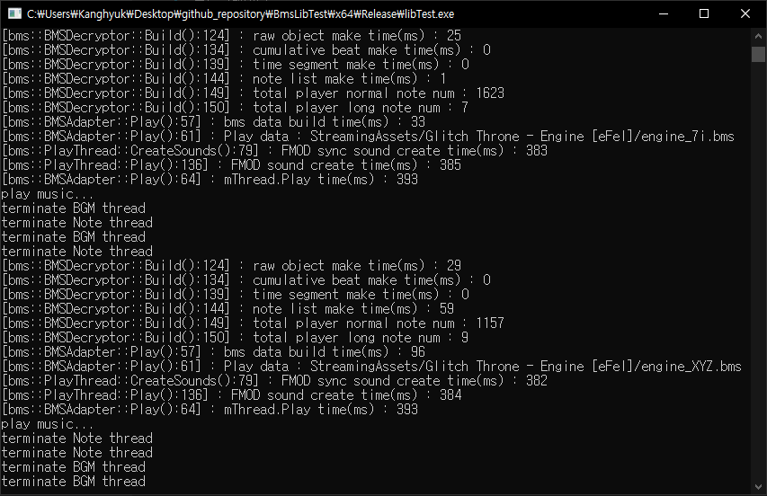

# BMSPlayer

* [BMS](http://hitkey.nekokan.dyndns.info/cmds.htm#MEMO-ABOUT-BMS-FORMAT-SPECIFICATION) 형식의 파일을 해석하고 [FMOD](https://www.fmod.com/) 라이브러리를 사용하여 음악을 재생해주는 프로그램
* 구동기를 만들기 전 BMS 해석 라이브러리를 테스트하는 용도로 제작된 프로그램이다.
* BMS 파일 및 음악 파일들은 별도로 다운받아야 한다.

## Environment & External Library

* OS : Windows 10 64bit
* IDE : Visual Studio Community 2017 15.9.11
* Library
  * [FMOD Studio API 2.00.08](https://www.fmod.com/download)

## Usage

* `StreamingAssets` 폴더를 만든 뒤 해당 폴더에 BMS 파일을 포함하는 폴더를 집어넣는다.
  * 최대 뎁스-2 까지 BMS 파일을 인식할 수 있다.
    * `StreamingAssets/BMSFolder` OK
    * `StreamingAssets/Folder/BMSFolder` OK
    * `StreamingAssets/Folder1/Folder2/BMSFolder` NO
* 키보드의 상하좌우 화살표 버튼으로 이동이 가능하다.
  * left arrow : prev folder
  * right arrow : next folder
  * up arrow : next music
  * down arrow : prev music
* 키보드의 `[, ]` 버튼으로 패턴 이동이 가능하다.
  * `[` : prev pattern
  * `]` : next pattern
* 디버그를 위해 IDE를 사용하는 경우 FMOD Library 를 링킹해야 한다.

## Sequence Diagram

## Inner Logic

## Reference

* [BMS command memo](http://hitkey.nekokan.dyndns.info/cmds.htm#CHARSET)
* [bemuse](https://github.com/bemusic/bemuse)
* [mkut/bms](https://github.com/mkut/bms/tree/master/BMSLib.Test)
* [Guide to understand BMS format](http://cosmic.mearie.org/2005/03/bmsguide/)